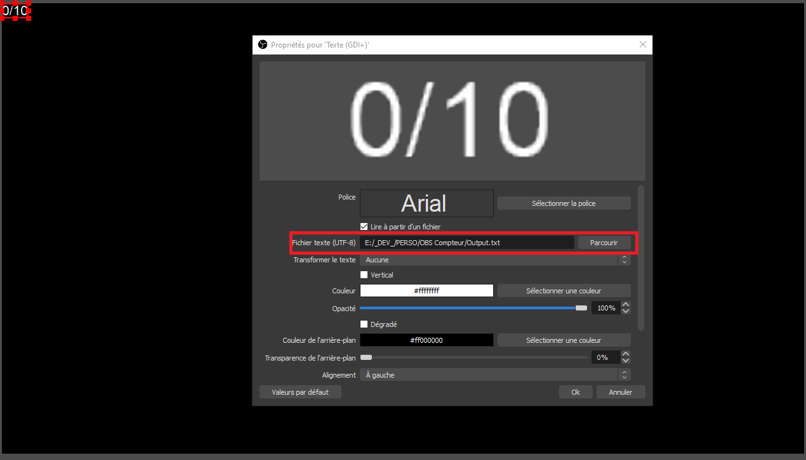

#### Compteur pour OBS avec AHK, spécialement pour le MarathonFinement

* Installez AutoHotKey https://www.autohotkey.com/

* Ajouter à OBS le chemin du fichier **Output.txt**

* Modifiez la valeur dans le fichier _Max.txt_ pour coller à votre défis _(ex: 50 pour avoir X / 50)_
* Double-cliquez **OBSCountScript.ahk** pour lancer le script

* Utilisez F12 pour Incrémenter le compteur
* Utilisez F11 pour Décrémenter le compteur

Si vous voulez d'autres touches de raccourcis :
* Soit vous modifiez OBSCountScript.ahk et remplacez F12 / F11 par une valeur valide
https://www.autohotkey.com/docs/KeyList.htm  
* Soit vous me contactez
